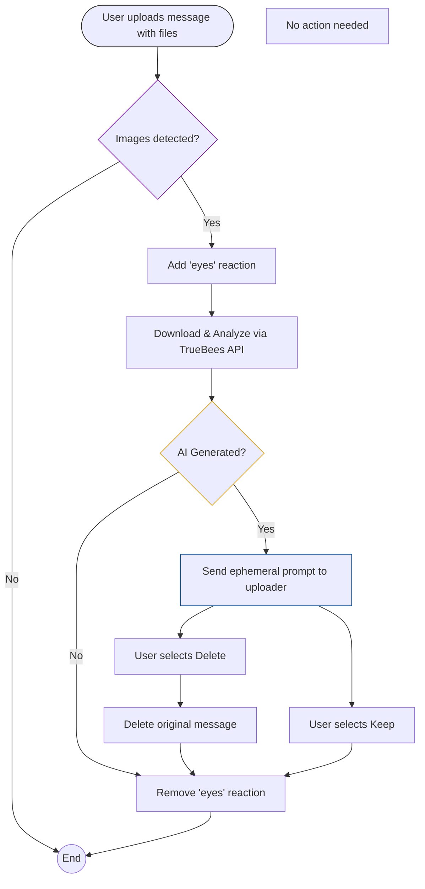

# 1. Purpose

The bot monitors Slack messages with image attachments, sends those images to TrueBees for AI-generation analysis, and gives the uploader a moderation choice when an image is likely AI-generated.

Primary user outcome:

- Upload image in Slack.
- Bot analyzes in background.
- If flagged as likely AI-generated, uploader gets a private prompt to delete or keep the message.

## 2. Actors

- **Regular channel member (uploader)**: shares images and receives moderation prompt.
- **Other channel members**: see message and reaction activity but do not see moderation prompt.
- **Workspace moderator/operator**: configures tokens, starts bot.

## 3. Workflow

### 3.1 Upload and detection

User posts a message with one or more files.
Bot checks whether files are images (by mimetype or common image file extensions).
If no image is found, bot does nothing.

### 3.2 In-progress signal

If at least one image is detected, bot adds an eyes reaction to the message.
This reaction acts as the “analysis in progress” indicator for the channel.

### 3.3 Analysis lifecycle

Bot downloads each image from Slack.
Bot submits image to TrueBees verification API and polls for the result.
Polling stops when result is complete, or times out after about 120 seconds.

### 3.4 Outcome behavior

If image is not flagged as AI-generated, no user-facing message is posted.

If image is flagged as AI-generated, uploader receives an ephemeral prompt:
Message: “This image is likely AI-generated. Do you want to delete it?”
Buttons: Delete and Keep
The prompt is visible only to the uploader, not the channel.

### 3.5 User decision

- **Delete**:
  Bot attempts to delete the original message.
  Ephemeral prompt is removed afterward.
- **Keep**:
  Bot keeps original message unchanged.
  Ephemeral prompt is removed.

### 3.6 Completion signal

After all detected images in the message finish processing, bot removes the eyes reaction.

