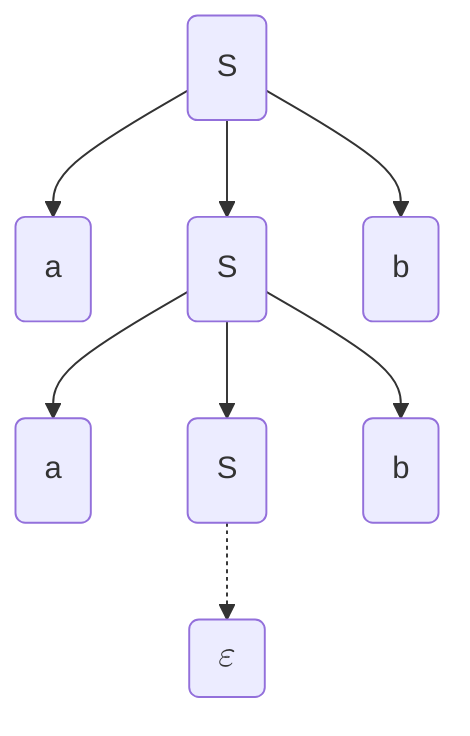

> Paola Quaglia - 2025/26

Traduzione da un linguaggio ad un altro
Trovo un albero di derivazione per andare verso un risultato. 

## Step della compilazione

>Analisi lessicale: traduce stream di caratteri in stream di token (e.g. <ID,pippo>, ASS, <NUM,2>, MUL...)

> Analisi sintattica: controlla se una stream di token aderisce a una grammatica, convertendolo in un parse tree o abstract syntax tree.

Parse Tree: ogni nodo contiene una lista di operazioni in ordine, le sotto operazioni (e.g. espressioni in un assegnamento) sono unite da un padre.
ABS: ogni nodo operazione contiene i suoi operandi.

> Analisi semantica: controllo validità delle operazioni (e.g. type checking)

Generazione del codice intermedio, da albero/grafo a codice.

Generazione codice macchina

Front-end del compilatore: da analisi lessicale a codice intermedio
Back-end: tutto il resto
Così, avendo $N$ linguaggi e $K$ macchine, ho $N*K$ compilatori. 

## Contenuto del corso
- Strutture pervasive:
	- automi a stati finiti
	- grammatiche
	- alberi e grafi
- metodologie alle basi di molte aree e.g.:
	- parsing di linguaggio naturale
	- sonorità di db query

Quindi:
- linguaggi regolari e automi a stati finiti (analisi sintattica)
- linguaggi context-free e parsing (analisi sintattica)
- analisi semantica (grammatiche arricchite e symbol tables)
- generazione codice intermedio
- generazione codice macchina (no)
- tecniche di ottimizzazione (no)

Libro: `Compilers: Principles, Techniques, and Tool (2nd edition); Aho et al.`

### Esame
Scritto: senza supporti, 5 domande basiche, meccaniche (applicazioni algoritmi) e per mettersi in mostra. Salto d'appello per chi non si presenta.
Orale
Voto 50/50 scritto e orale.

## Grammatiche Generative

Simboli terminali e non terminali.  I terminali sono l'output dell'analisi lessicale. I simboli maiuscoli sono quelli non terminali.
Start symbol: non terminale.
	Inoltre, insieme di produzioni (traduzioni), da \<a\> a \<b\> con almeno un terminale in \<b\>.
Il carattere speciale $\varepsilon$ rappresenta la parola vuota.
Un linguaggio può essere generato da più grammatiche.

#### Formalmente
è una tupla $(V,T,S,P)$ con:
- V un vocabolario di terminali e non terminali
- T un insieme di terminali
- S è lo start symbol
- P è l'insieme delle produzioni

Convenzione:
- Lettere maiuscole tipo A e B sono non terminali
- Lettere maiuscole tipo X e Y sono simboli del vocabolario
- Lettere minuscole tipo a e b sono terminali
- Lettere greche tipo $\alpha$ e $\beta$ sono 0 o più ripetizioni di simboli nel vocabolario base
- $w,w_0$ sono stringhe di terminali

Linguaggio generato: $G=(V,T,S,P), L(G)=\{w|w\in T^* \;and\;S\implies^+w\}$

L è un linguaggio context-free se è solo se esiste una grammatica libera che genera L.

Derivazioni canoniche: 
- rightmost e leftmost, sostituisci sempre il non terminale più a destra/sinistra
- sceglie quale sostituire, non come.

Albero di derivazione, i terminali sono le foglie.

Data la grammatica:
$$ \begin{eqnarray}
S& \to &aSb | \varepsilon \\
a& \to &\varepsilon \\
b& \to &\varepsilon
\end{eqnarray}
$$
Si può avere il seguente albero di derivazione

