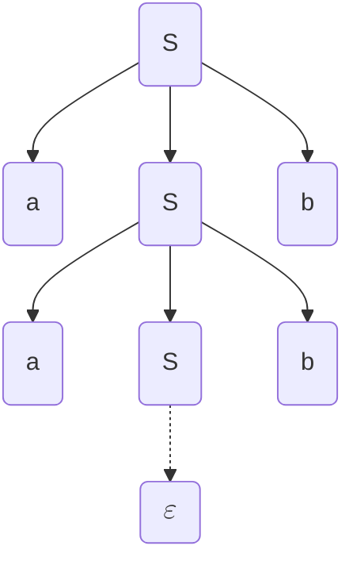
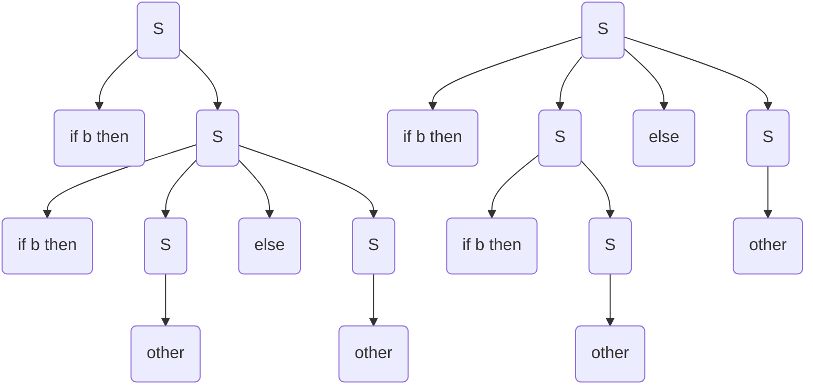
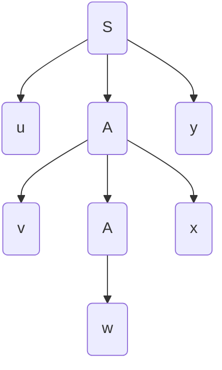
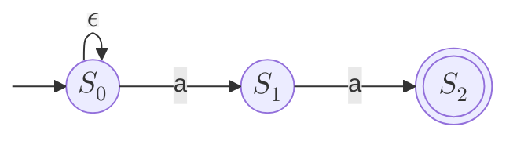

> Paola Quaglia - 2025/26

Traduzione da un linguaggio ad un altro
Trovo un albero di derivazione per andare verso un risultato. 

## Step della compilazione

>Analisi lessicale: traduce stream di caratteri in stream di token (e.g. <ID,pippo>, ASS, <NUM,2>, MUL...)

> Analisi sintattica: controlla se una stream di token aderisce a una grammatica, convertendolo in un parse tree o abstract syntax tree.

Parse Tree: ogni nodo contiene una lista di operazioni in ordine, le sotto operazioni (e.g. espressioni in un assegnamento) sono unite da un padre.
ABS: ogni nodo operazione contiene i suoi operandi.

> Analisi semantica: controllo validità delle operazioni (e.g. type checking)

Generazione del codice intermedio, da albero/grafo a codice.

Generazione codice macchina

Front-end del compilatore: da analisi lessicale a codice intermedio
Back-end: tutto il resto
Così, avendo $N$ linguaggi e $K$ macchine, ho $N*K$ compilatori. 

## Contenuto del corso
- Strutture pervasive:
	- automi a stati finiti
	- grammatiche
	- alberi e grafi
- metodologie alle basi di molte aree e.g.:
	- parsing di linguaggio naturale
	- sonorità di db query

Quindi:
- linguaggi regolari e automi a stati finiti (analisi sintattica)
- linguaggi context-free e parsing (analisi sintattica)
- analisi semantica (grammatiche arricchite e symbol tables)
- generazione codice intermedio
- generazione codice macchina (no)
- tecniche di ottimizzazione (no)

Libro: `Compilers: Principles, Techniques, and Tool (2nd edition); Aho et al.`

### Esame
Scritto: senza supporti, 5 domande basiche, meccaniche (applicazioni algoritmi) e per mettersi in mostra. Salto d'appello per chi non si presenta.
Orale
Voto 50/50 scritto e orale.

## Grammatiche Generative

Simboli terminali e non terminali.  I terminali sono l'output dell'analisi lessicale. I simboli maiuscoli sono quelli non terminali.
Start symbol: non terminale.
	Inoltre, insieme di produzioni (traduzioni), da \<a\> a \<b\> con almeno un terminale in \<b\>.
Il carattere speciale $\varepsilon$ rappresenta la parola vuota.
Un linguaggio può essere generato da più grammatiche.

### Formalmente
è una tupla $(V,T,S,P)$ con:
- V un vocabolario di terminali e non terminali
- T un insieme di terminali
- S è lo start symbol
- P è l'insieme delle produzioni

Convenzione:
- Lettere maiuscole tipo A e B sono non terminali
- Lettere maiuscole tipo X e Y sono simboli del vocabolario
- Lettere minuscole tipo a e b sono terminali
- Lettere greche tipo $\alpha$ e $\beta$ sono 0 o più ripetizioni di simboli nel vocabolario base
- $w,w_0$ sono stringhe di terminali

Linguaggio generato: $G=(V,T,S,P), L(G)=\{w|w\in T^* \;and\;S\implies^+w\}$

L è un linguaggio context-free se è solo se esiste una grammatica libera che genera L.

Derivazioni canoniche: 
- rightmost e leftmost, sostituisci sempre il non terminale più a destra/sinistra
- sceglie quale sostituire, non come.

Albero di derivazione, i terminali sono le foglie.

Data la grammatica:
$$ \begin{eqnarray}
S& \to &aSb | \varepsilon \\
a& \to &\varepsilon \\
b& \to &\varepsilon
\end{eqnarray}
$$
Si può avere il seguente albero di derivazione

### Ambiguità nelle grammatiche

>Una grammatica è **ambigua** se e solo se esiste una $w\in L(G)$ che può essere generata da due derivazioni canoniche distinte, o entrambe rightmost o entrambe leftmost.

Ad esempio la grammatica
$$
\begin{eqnarray}
S \to & \text {if b then S } &| \\
& \text{if b then S else S } &| \\
& \text{other}&
\end{eqnarray}
$$
è ambigua:

Qua sopra l'ordine degli if è diverso, a parità di risultato.
L'ambiguità è indecidibile, non ci sono algoritmi per decidere se una grammatica è ambigua o no.

## Proprietà dei linguaggi liberi

### Lemma
Data una grammatica $G$ si può ottenere una grammatica $G'$ da $G$ cambiando tutti i suoi non terminali con simboli nuovi. Allora $\mathcal L(G')=\mathcal L(G)$.

C'è la dimostrazione, serve?

### Lemmi
La classe dei linguaggi liberi è chiusa rispetto all'unione insiemistica.
La classe dei linguaggi liberi è chiusa rispetto alla concatenazione.

### Chomsky normal form
Sia $\mathcal L$ un linguaggio libero da contesto. Allora esiste una grammatica $\mathcal G$ per cui $\mathcal L(\mathcal G)=\mathcal L \\ \{\epsilon \}$ e $\mathcal G$ t.c.:
- Non ha $\epsilon$-produzioni
- Non ha produzioni unitarie (forma $A\to B$)
- Non ha non-terminali inutili (che non compaiono mai in derivazioni di stringhe)
- Ogni produzione è in una delle due forme
	- $A\to a$
	- $A\to A_1A_2$

Passi di trasformazione:
- annullamento produzioni $\epsilon$
	- induttivamente, trovo non-terminali annullabili (base $A\to a$, iter $A\to Y_1,Y_2,\dots ,Y_n$ annullabili)
	- riscrivo le produzioni considerando tutte le combinazioni in cui i non terminali vengono annullati.
	- elimino le produzioni con le $\epsilon$
- eliminazione non terminali inutili
	- li elimino e bom
- eliminazione produzioni unitarie
	- sposto le produzioni dei non terminali inutili al non terminale superiore.
- cambio tutto nella forma binaria
	- aggiungo non terminali per stringhe miste di terminali e non
	- aggiunge terminali per stringhe con lunghezza >2

manca la produzioni di epsilon da S

### Pumping lemma
Dato $\mathcal L$ un linguaggio libero, allora
- $\exists p\in\Bbb N^+$ t.c.
- $\forall z \in \mathcal L$ t.c. $|z|>p$
- $\exists u,v,w,x,y$ t.c.
	- $z=uvwxy$ e
	- $|vwx|\le p$ e
	- $|vx|> 0$ e
	- $\forall i \in \Bbb N.uv^iwx^iy\in\mathcal L$

In questo albero che genera g, ho una coppia di A (la più profonda coppia di non terminali uguali).Posso replicare la derivazione tra i due e fare *pumping*, moltiplicando v e x.
u y e w possono essere $\epsilon$, almeno una tra v e x non lo sono.

Io per ogni specifico linguaggio ho una p unica ($2^{k+1}$ con k numero di terminali), non è detto che tutti abbiano una z più lunga di p.

Tesi negata:
$$\forall p\in\Bbb N^+.\forall z \in \mathcal L : |z|>p.\forall u,v,w,x,y.$$
$$(z=uvwxy\,and\,|vwx|\le p\,and\,|vx|>0)\implies \exists i\in\Bbb N.uv^iwx^iy\notin \mathcal L$$
### Lemma
Non è vero che dati due linguaggi liberi la loro intersezione non è libera

## Top-down Parsing

>**Parsing:** data una grammatica e una parola, vogliamo capire se una parola è generata dalla grammatica e fornire un albero di derivazione.

Due tipi di parsing, top-down che costruisce una derivazione leftmost e bottom-up che costruisce rightmost dalla frontiera alla radice.

Si evita il backtrack, si può usare il top down parsing predittivo, sulle grammatiche $LL(1)$. Queste grammatiche permettono di create deterministicamente una stringa leggendo da sinistra un simbolo alla volta.

**Parsing Table:** indica per ogni terminale (che sarà in posizione iniziale) e non terminale (stato corrente) quale produzione utilizzare.
Nella tabella setto $M[A,b]=A\to \alpha$ se:
- o da $\alpha$ arrivo in un certo numero di passo derivo una stringa che comincia per b
- o da $\alpha$ posso derivare $\epsilon$ e in qualche derivazione A è seguito da un qualche $\gamma$ da cui si può derivare una stringa che comincia con b.
Questa è l'introduzione a due *famosissimi* (ndr. mai sentiti) **first e follow**.

#### First
$\mathbf {first(\alpha)}$ è l'insieme di terminali che stanno all'inizio di stringhe che derivano da $\alpha$, tra i quali ci **può** essere $\epsilon$ .
L'algoritmo è semplice, data una stringa $\alpha$ aggiungo i first del primo elemento a $first(\alpha)$, se c'è $\epsilon$ allora procedo anche con l'elemento successivo. Se sono arrivato alla fine aggiungo anche $\epsilon$.
#### Follow
$\mathbf{follow(A)}$ è l'insieme di terminali che possono seguire A in qualche derivazione.

Per ogni  $A\to\alpha$ aggiungo alla tabella:
- $M[A,b]=\alpha$ se $b\in first(\alpha)$
- Se $\epsilon\in first(\alpha)$ allora $M[A,b] =\epsilon \;\forall b\in follow(\alpha)$

**Grammatica Left Recursive:** se per qualche A e qualche $\alpha$, $A\Rightarrow^* A\alpha$. Queste non sono LL(1). Quelle immediatamente ricorsive hanno produzioni in forma $A\to A\alpha$.
Si può modificare una grammatica left recursive per farla diventare LL(1). Con un po' di sostituzioni.
**Esempio**
$A\to Ba|b$
$B\to Bc|Ad|b$
Se ho $A\Rightarrow Ba\Rightarrow Ada$ rimpiazzo $B\to Ad$ con $B\to Bad| db$, cioè le produzioni che avrei con A. Introduco un nuovo non terminale che si postpone:
$B\to dbB'| cB'$
$B'\to cB'|adB'|\epsilon$

Quindi, per le ricorsioni immediate:
Sostituisco $A\to A\alpha | \beta$
avendo $\alpha \ne \epsilon$ e $\beta\ne A\gamma$ 
con:
$A\to \beta A'$
$A'\to\alpha A' | \epsilon$

### Left factoring
Quando due produzioni dello stesso non terminale hanno lo stesso prefisso. Queste grammatiche non sono LL(1). Posso *raccogliere* il prefisso creando un nuovo non terminale.

$\mathcal G$ è LL(1) $\iff\mathcal G$ ha una produzione $A\to\alpha|\beta$ tale che:
- $first(\alpha)\cap first(\beta) = \emptyset$
- se $\epsilon \in first(\alpha)$ allora $first(\beta)$ ... continua

## Linguaggi regolari
Per riconoscere un linguaggio non per forza ho bisogno delle espressioni matematiche che abbiamo usato fino ad adesso, una **macchina a stati** è abbastanza.
Questi linguaggi sono definiti da espressioni regolari, riconosciuti da automi a stati finiti deterministici e non.
### Regex
Abbiamo questi operatori:
- `|` è l'alternazione
- `.` è la concatenazione (omettibile)
-  `*` è la ripetizione
- `()` è triviale
Il linguaggio denotato da una regex si definisce induttivamente, ricorsivamente sui vari operatori usando il singolo carattere o $\epsilon$. Si possono scrivere formalmente in modo insiemistico i vari operatori ma è triviale.

Ordine operatori (precedenza):
- kleene star, associa a sinistra
- concatenazione, associa a sinistra
- alternazione, associa a sinistra

### NFA (non deterministic finite state automata)
Sono delle tuple $(S,\mathcal A,mode_n,s_0,F)$ dove:
- S è un insieme di stati
- $\mathcal A$ è un alfabeto con $\epsilon \notin \mathcal A$
- $s_0\in S$ è lo stato iniziale
- $F\subseteq S$ è un insieme di stati finali (o accettabili)
- $move_n:S \times (\mathcal A\cup \{\epsilon\})\to 2^S$
Si rappresenta come un grafo diretto:

Un NFA $\mathcal N$ accetta (o riconosce) w se e solo se esiste almeno un cammino spelling w dal suo stato iniziale a uno dei suoi stati finali.

#### Costruzione di Thompson
Un algoritmo che costruisce un NFA data un'espressione regolare.

Ogni step introduce al massimo 2 nuovi stati, avremo quindi al massimo $2k$ stati, dove k è il numero di simboli e operatori nell'espressione regolare.
In ogni NFA intermedio c'è:
- esattamente uno stato finale
- nessun arco entrante entranti negli stati iniziali
- nessun arco uscente dallo stato finale

Il metodo è abbastanza semplice, costruisci dei bivi quando c'è l'alternazione, metti in fila con la concatenazione e metti loop con la ripetizione.
#### Simulazione di un NFA
Bisogna capire data una parola w e un NFA se $w\in\mathcal L(\mathcal N)$.

**$\epsilon$-closure:** è l'insieme di stati raggiungibili da un dato stato t in zero o più $\epsilon$-transizioni.
La simulazione (con n stati e m archi) ha complessità $O(|w|(n+m))$ e nel caso di Thompson è $O(|w||r|)$. Il processo intero costa sempre $O(|w||r|)$ perché la costruzione di Thompson è $O(|er|)$.
### DFA (deterministic finite state automata)
Sono delle tuple $(S,\mathcal A, move_d, s_0, F)$ con $move_d:S\times\mathcal A\to S$.
Quindi non ci sono $\epsilon$-transizioni, la move è :
- **totale** se da ogni stato c'è esattamente una a-transizione per ogni $a\in\mathcal A$.
- **parziale** se c'è al massimo una a-transizione per ogni $a\in\mathcal A$.
Quando è totale posso andare da ogni stato usando ogni etichetta in un altro stato. Se è parziale non posso andare da ogni stato in un altro usando tutte le etichette.

Il linguaggio riconosciuto da un DFA $\mathcal D$, denotato con $\mathcal L(\mathcal D)$, è l'insieme di parole w tali che... *uguale ai NFA*.
#### Subset construction
Dato un NFA costruisco un DFA che riconosce lo stesso linguaggio. Uso le $\epsilon$-closure per mappare i sottoinsiemi di stati in un solo stato.
#### Minimizzazione
Esiste un algoritmo per minimizzare un DFA. Questo algoritmo funziona solo su automi con funzioni di move totali. Algoritmo *partition refinement*.
Inizi partizionando gli stati e raffinando le partizioni (o blocchi). Comincio dagli stati finali e tutti gli altri.
Quindi:
- partiziono
- controllo se ci sono stati equivalenti in un blocco
- se no *raffino* dividendo il blocco dividendolo ancora
- così ogni blocco rappresenta uno stato di equivalenza.

In pratica, mano a mano splitto gli stati che raggiungono altri blocchi con delle a-transizioni o no.
#### Numero di stati di un DFA
**Lemma:** per ogni $n\in\Bbb N$ esiste un NFA con n stati la cui forma minima di DFA ha almeno $2^n$ stati.

Esiste poi un pumping lemma per i linguaggi regolari. Solo che invece di *uvwxy* ho solo *uvw*, con v che *pumpa*.
#### Generatore di analizzatori lessicali
Un esempio è flex, il generatore di c, perché in pratica creare un DFA è molto complesso e dispendioso. Dato il minimo numero di informazioni questi tool sono capaci di creare un DFA per il linguaggio specificato.