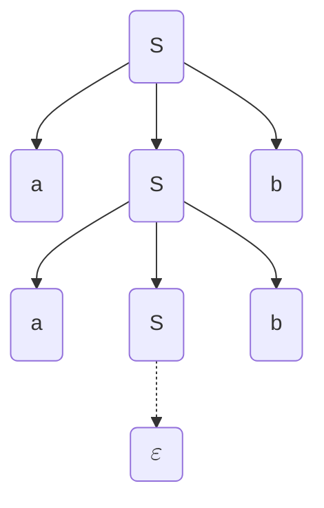
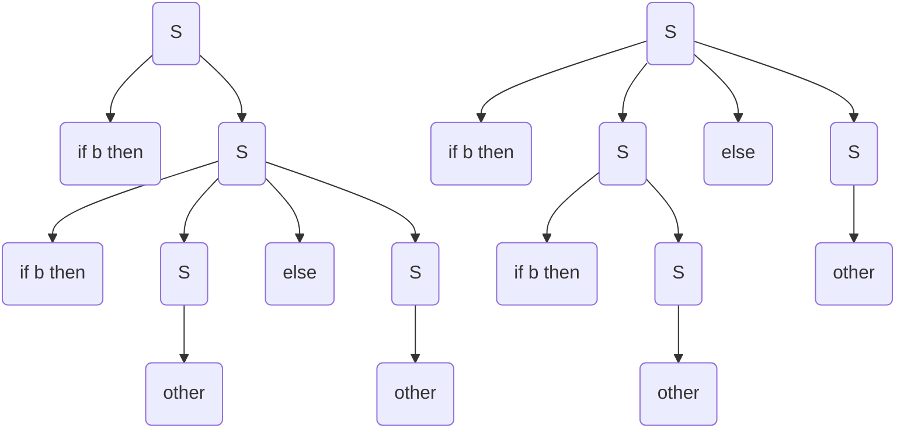
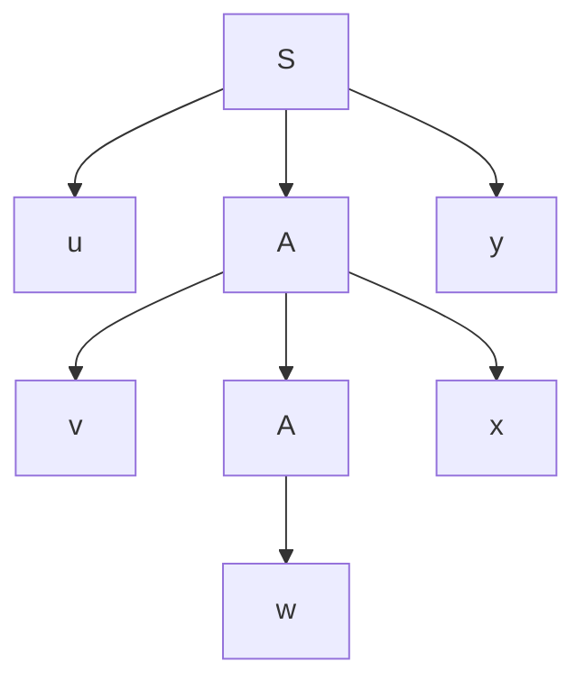

> Paola Quaglia - 2025/26

Traduzione da un linguaggio ad un altro
Trovo un albero di derivazione per andare verso un risultato. 

## Step della compilazione

>Analisi lessicale: traduce stream di caratteri in stream di token (e.g. <ID,pippo>, ASS, <NUM,2>, MUL...)

> Analisi sintattica: controlla se una stream di token aderisce a una grammatica, convertendolo in un parse tree o abstract syntax tree.

Parse Tree: ogni nodo contiene una lista di operazioni in ordine, le sotto operazioni (e.g. espressioni in un assegnamento) sono unite da un padre.
ABS: ogni nodo operazione contiene i suoi operandi.

> Analisi semantica: controllo validità delle operazioni (e.g. type checking)

Generazione del codice intermedio, da albero/grafo a codice.

Generazione codice macchina

Front-end del compilatore: da analisi lessicale a codice intermedio
Back-end: tutto il resto
Così, avendo $N$ linguaggi e $K$ macchine, ho $N*K$ compilatori. 

## Contenuto del corso
- Strutture pervasive:
	- automi a stati finiti
	- grammatiche
	- alberi e grafi
- metodologie alle basi di molte aree e.g.:
	- parsing di linguaggio naturale
	- sonorità di db query

Quindi:
- linguaggi regolari e automi a stati finiti (analisi sintattica)
- linguaggi context-free e parsing (analisi sintattica)
- analisi semantica (grammatiche arricchite e symbol tables)
- generazione codice intermedio
- generazione codice macchina (no)
- tecniche di ottimizzazione (no)

Libro: `Compilers: Principles, Techniques, and Tool (2nd edition); Aho et al.`

### Esame
Scritto: senza supporti, 5 domande basiche, meccaniche (applicazioni algoritmi) e per mettersi in mostra. Salto d'appello per chi non si presenta.
Orale
Voto 50/50 scritto e orale.

## Grammatiche Generative

Simboli terminali e non terminali.  I terminali sono l'output dell'analisi lessicale. I simboli maiuscoli sono quelli non terminali.
Start symbol: non terminale.
	Inoltre, insieme di produzioni (traduzioni), da \<a\> a \<b\> con almeno un terminale in \<b\>.
Il carattere speciale $\varepsilon$ rappresenta la parola vuota.
Un linguaggio può essere generato da più grammatiche.

### Formalmente
è una tupla $(V,T,S,P)$ con:
- V un vocabolario di terminali e non terminali
- T un insieme di terminali
- S è lo start symbol
- P è l'insieme delle produzioni

Convenzione:
- Lettere maiuscole tipo A e B sono non terminali
- Lettere maiuscole tipo X e Y sono simboli del vocabolario
- Lettere minuscole tipo a e b sono terminali
- Lettere greche tipo $\alpha$ e $\beta$ sono 0 o più ripetizioni di simboli nel vocabolario base
- $w,w_0$ sono stringhe di terminali

Linguaggio generato: $G=(V,T,S,P), L(G)=\{w|w\in T^* \;and\;S\implies^+w\}$

L è un linguaggio context-free se è solo se esiste una grammatica libera che genera L.

Derivazioni canoniche: 
- rightmost e leftmost, sostituisci sempre il non terminale più a destra/sinistra
- sceglie quale sostituire, non come.

Albero di derivazione, i terminali sono le foglie.

Data la grammatica:
$$ \begin{eqnarray}
S& \to &aSb | \varepsilon \\
a& \to &\varepsilon \\
b& \to &\varepsilon
\end{eqnarray}
$$
Si può avere il seguente albero di derivazione

### Ambiguità nelle grammatiche

>Una grammatica è **ambigua** se e solo se esiste una $w\in L(G)$ che può essere generata da due derivazioni canoniche distinte, o entrambe rightmost o entrambe leftmost.

Ad esempio la grammatica
$$
\begin{eqnarray}
S \to & \text {if b then S } &| \\
& \text{if b then S else S } &| \\
& \text{other}&
\end{eqnarray}
$$
è ambigua:

Qua sopra l'ordine degli if è diverso, a parità di risultato.
L'ambiguità è indecidibile, non ci sono algoritmi per decidere se una grammatica è ambigua o no.

## Proprietà dei linguaggi liberi

#### Lemma
Data una grammatica $G$ si può ottenere una grammatica $G'$ da $G$ cambiando tutti i suoi non terminali con simboli nuovi. Allora $\mathcal L(G')=\mathcal L(G)$.

C'è la dimostrazione, serve?

#### Lemmi
La classe dei linguaggi liberi è chiusa rispetto all'unione insiemistica.
La classe dei linguaggi liberi è chiusa rispetto alla concatenazione.

### Chomsky normal form
Sia $\mathcal L$ un linguaggio libero da contesto. Allora esiste una grammatica $\mathcal G$ per cui $\mathcal L(\mathcal G)=\mathcal L \\ \{\epsilon \}$ e $\mathcal G$ t.c.:
- Non ha $\epsilon$-produzioni
- Non ha produzioni unitarie (forma $A\to B$)
- Non ha non-terminali inutili (che non compaiono mai in derivazioni di stringhe)
- Ogni produzione è in una delle due forme
	- $A\to a$
	- $A\to A_1A_2$

Passi di trasformazione:
- annullamento produzioni $\epsilon$
	- induttivamente, trovo non-terminali annullabili (base $A\to a$, iter $A\to Y_1,Y_2,\dots ,Y_n$ annullabili)
	- riscrivo le produzioni considerando tutte le combinazioni in cui i non terminali vengono annullati.
	- elimino le produzioni con le $\epsilon$
- eliminazione non terminali inutili
	- li elimino e bom
- eliminazione produzioni unitarie
	- sposto le produzioni dei non terminali inutili al non terminale superiore.
- cambio tutto nella forma binaria
	- aggiungo non terminali per stringhe miste di terminali e non
	- aggiunge terminali per stringhe con lunghezza >2

manca la produzioni di epsilon da S

#### Pumping lemma
Dato $\mathcal L$ un linguaggio libero, allora
- $\exists p\in\Bbb N^+$ t.c.
- $\forall z \in \mathcal L$ t.c. $|z|>p$
- $\exists u,v,w,x,y$ t.c.
	- $z=uvwxy$ e
	- $|vwx|\le p$ e
	- $|vx|> 0$ e
	- $\forall i \in \Bbb N.uv^iwx^iy\in\mathcal L$

In questo albero che genera g, ho una coppia di A (la più profonda coppia di non terminali uguali).Posso replicare la derivazione tra i due e fare *pumping*, moltiplicando v e x.
u y e w possono essere $\epsilon$, almeno una tra v e x non lo sono.

Io per ogni specifico linguaggio ho una p unica ($2^{k+1}$ con k numero di terminali), non è detto che tutti abbiano una z più lunga di p.

Tesi negata:
$$\forall p\in\Bbb N^+.\forall z \in \mathcal L : |z|>p.\forall u,v,w,x,y.$$
$$(z=uvwxy\,and\,|vxy|\le p\,and\,|vx|>0)\implies \exists i\in\Bbb N.uv^iwx^iy\notin \mathcal L$$
