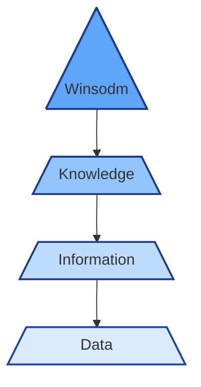
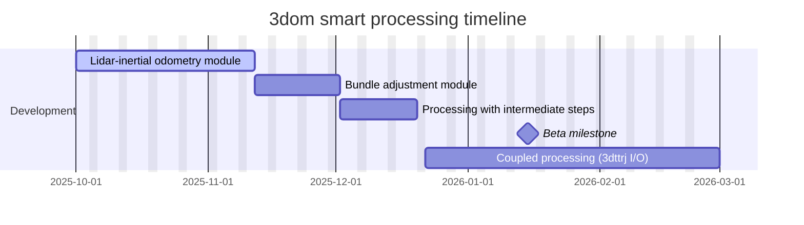

> Fausto Giunchiglia 2025/26

Esame con parte teorica e applicativa (modellistica) 40/60.
Due parziali, primo il 7 novembre, il secondo la settimana prima di natale. Sono indipendenti l'uno dall'altro, il voto finale è la media. Le domande sono tutte stronze a trabocchetto.
[Sito del corso](https://datascientiafoundation.github.io/datascientia-education-logica-2025-26-unitn/)

Il corso è diviso in Human Practice to Theory e Theory to Machine Practice.
# HP2T
## Premesse
**Logica:** formalizzazione del ragionamento (umano e non).
**Ragionare:** partire da assiomi e assunzioni per raggiungere una conclusione.

Passi:
- linguaggio formale
- regole di inferenza
- correttezza e completezza (rispetto a una semantica intesa)
- algoritmi di ragionamento.
Correttezza e completezza si verifica con la teoria degli insieme.

Logiche:
- logica filosofica
	- modale
- logica matematica
- logica computazionale
	- logiche descrittive (relational DB)

## Attività Mentale
**Percezione**: vediamo quello che scegliamo di vedere. Andare dalla realtà alle percezioni e fatti, cioè la nostra rappresentazione mentale della realtà.
**Concettualizzazione**: associazione di una parola a un concetto. 
**Ragionamento**: da concetti a proprietà, entità e tipi di entità. Basandosi su asserzioni, cioè la conoscenza, con regole. Può essere fallace (formalmente o informalmente, struttura o contenuto).

I quattro livelli sono:
1. percezioni e fatti
2. concetti
3. entità, proprietà, tipi di entità, asserzioni e conoscenza (espressi con un linguaggio regolato)
4. proposizioni (nuova conoscenza)

## Logica

> La logica ci da una struttura per modellare il mondo e il nostro modo di pensare.

applicazioni:
- ingegneria del software, con linguaggi di specificazione e linguaggi di implementazioni.
- metodi formali, correttezza e completezza di specifiche e metodi.
- intelligenza artificiale, ragionamento automatico etc.

Mondo, memoria, rappresentazione mentale (e.g. un database) e gap semantico.
La rappresentazione mentale può essere:
- analogica, generata dalla percezione (memoria subconscia in psico)
- linguistica, generata da un input linguistico (memoria semantica in psico)

**(In)Consistenza**: si parla di inconsistenza, che si formalizza come $A\land \lnot A$ (A and not A). Una rappresentazione mentale è inconsistente quando rappresenta uno stato del mondo che è impossibile per quello che sappiamo. Consistenza è l'assenza di inconsistenza.

Gli umani costruiscono una delle tante rappresentazione analogiche e linguistiche, due rappresentazioni mentali soggettive possono essere mutualmente inconsistenti. Ciò dimostra che la soggettività è coinvolta.

**Rappresentazione:** oggettizzazione della rappresentazione mentale, permettono di condividere, comunicare le proprie rappresentazioni. Usate per minimizzare le non comprensioni.

$$\frac{\text{if A then B},A}B $$
### Piramide DIKW

### Piramide di attività
- ragionamento
- comprensione
- concettualizzazione
- percezione
### Piramide di rappresentazione
- proposizioni
- asserzioni
- concetti/concettualizzazioni
- percetti/percezioni
- dati
### Piramide logica
- logica di ragionamento
- logica del mondo
- modelli del mondo
- modelli

## Modelli
Come già detto, abbiamo entità, tipi di entità, proprietà delle entità, tipi di proprietà, relazioni tra le entità e tipi di relazioni.
Uno dei problemi è stabilire l'uguaglianza di due entità, partendo dal tipo.
Usiamo la teoria degli insiemi, che offre una buona rappresentazione grafica e una possibilità di essere convertita in funzioni e domini.
Con un insieme di tuple specifico le proprietà e le relazioni, 

Un **percetto** è una qualunque cosa che è percepita in modo diversa dalle altre. Chiamiamo **dominio di interpretazione** l'insieme dei percetti che consideriamo. Possiamo distinguere i percetti basandoci sull'analisi di quello che percepiamo.
$$D=<U,\{C\},\{R\}>$$
Nel dominio di interpretazione, U è l'universo di interpretazione, C è un insieme di classi, R un insieme di relazioni n-arie. Abbiamo appunto unità, classi e relazioni.
I fatti sono delle relazioni, di tipo *membro di* oppure *sottoinsieme/superinsieme di*.
La teoria dei modelli è la disciplina che studio la struttura dei modelli come una funzione di tipi di fatti e percetti specifici.

Un linguaggio è definito come $L=<A,FR>=\{s\}$, con A l'alfabeto e FR le formation rules, un insieme di regole di generazione.

Una teoria è un insieme di fatti, una teoria T può essere corretta per un modello M. Una rappresentazione del mondo è una coppia teoria modello. Le teorie non sono necessariamente complete.

### Rappresentazioni canoniche del mondo
Un modello canonico per una teoria è il modello per cui la teoria è massimale (completa).

# T2MP
## Rappresentazione (machine)
Riassunto:
- percezione
- concettualizzazione
- comprensione
- ragionamento
Semantic Gap: differenze tra persone e modi diversi di rappresentare mentalmente.

**Grammatica Formale**: come in LFC, terminali e non, regole di produzione.

### Rappresentazioni:
#### Tabelle
Come in database relazionale, una tabella per ogni tipo di entità con campi finiti.
#### Grafi
Vari nodi, i nodi hanno delle proprietà, sono collegati ad altri nodi con relazioni.
#### Rappresentare la conoscenza
Parliamo solo dei tipi, non delle entità. Si può usare un ER diagram, 
#### Rappresentare i concetti
WordNet è un lessico digitalizzato, contiene dei set di sinonimi (synsets). Contiene i collegamenti tra i concetti, opposizioni, somiglianza, componenti di e generalizzazioni.

**DType:** un tipo di EType con proprietà fissate (datatype).