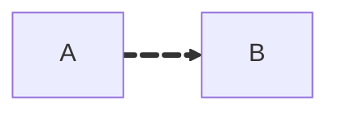

> Fausto Giunchiglia 2025/26

Esame con parte teorica e applicativa (modellistica) 40/60.
Due parziali, primo il 7 novembre, il secondo la settimana prima di natale.
[Sito del corso](https://datascientiafoundation.github.io/datascientia-education-logica-2025-26-unitn/)

## Intro
**Logica:** formalizzazione del ragionamento (umano e non).
**Ragionare:** partire da assiomi e assunzioni per raggiungere una conclusione.

Passi:
- linguaggio formale
- regole di inferenza
- correttezza e completezza (rispetto a una semantica intesa)
- algoritmi di ragionamento.
Correttezza e completezza si verifica con la teoria degli insieme.

Logiche:
- logica filosofica
	- modale
- logica matematica
- logica computazionale

