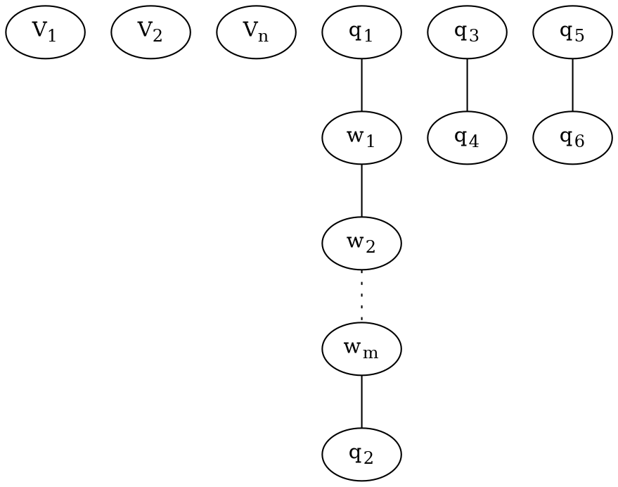

Dato un insieme V, definiamo con $\binom V2$ (che si legge "V su 2") l'insieme i cui elementi sono tutti e soli i sottoinsiemi di V con 2 elementi (cioè 2-sottoinsiemi di V). In simboli, $\binom V2:=\{A\in 2^V||A|=2\}$.

$|\binom V2=\binom {|V|}2=\frac{|V||!}{2!(|V|-2)!}$

### Grafo semplice
Un grafo (semplice, non orientato) G è una coppia $G=(V,E)$ dove V è un insieme non vuoto detto insieme dei vertici di G e E è un sottoinsieme (eventualmente vuoto) di $\binom V2$ detto insieme dei lati di G.
Si indicano con $V(G)$ e $E(G)$.

### Grafi notevoli
1. Per ogni $n\in\Bbb N$, definiamo il cammino $P_n$ di lunghezza n. 
   - $V(P_n):=\{0,1,\dots,n\}$
   - $E(P_n):=\varnothing se\,n=0$
   - $E(P_n):=\{\{i,i+1\}\in\binom {V(P_n)}2|i\in\{0,1,\dots,n-1\}\}$
2. Per ogni $n\ge 3$, il ciclo $C_n$ di lunghezza n detto anche n-ciclo
   - $V(C_n):=\{0,1,\dots,n\}$
   - $E(C_n):=\{\{i,i+1\}\in\binom {V(C_n)}2|i\in\{0,1,\dots,n-1\}\}\cup \{\{1,n\}\}$
3. Per ogni $n\ge 1$, il grafo completo su n vertici, denotato con $K_n$
   - $V(K_n):=\{0,1,\dots,n\}$
   - $E(K_n):=\binom{V(K_n)}{2}$

Def.
Siano $G=(V,E)$ e $G'=(V',E')$ due grafi. Diciamo che G' è un sottografo di G (in simboli $G'<G$) se
$$V'\subset V,E'\subset E$$
Se G' è un sottografo di G e vale 
$$E'=\{e\in E|e=\{v_1,v_2\},v_1\in V,v_2\in V'\}$$
allora G' si dice sottografo di G indotto da V' e si indica con $G'=G[V']$

### Morfismi e isomorfismi
Siano $G=(V,E)$ e $G'=(V',E')$ due grafi.
Una funzione $f:V\to V'$ che sia iniettiva si dice morfismo da G in G' se $\forall e=\{v_1,v_2\}\in E\implies f(e)=\{f(v_1),f(v_2)\}\in E'$

Una funzione $F:V(G)\to V(G')$ è un isomorfismo da G a G' se valgono:
1. f è una bigez
2. f è un morfismo da G in G'
3. $f^{-1}:V(G')\to V(G)$ è un morfismo da G' in G

Se esiste un isomorfismo da G in G' allora si dice G è isomorfo a G' e si scrive $G\cong G'$. 

### Passeggiate, cammini e cicli

Sia $G=(V,E)$ un grafo. Una successione finita ordinata $(V_0,V_1,\dots,V_n)$ di vertici G (per qualche $n\in\Bbb N$) si dice:
- Passeggiata in G se n=0 oppure se $n\ge 1$ e $\{V_i,V_{i+1}\}\in E\,\forall i\in\{0,1,\dots,n-1\}$
- Cammino in G se è passeggiata in G e $V_i\ne V_j\,\forall i,j\in\{0,1,\dots,n\}$
- Ciclo in G se è una passeggiata in G, $n\ge 3$, $V_0=V_n$ e $(V_0,V_1,\dots,V_{n-1})$ è un cammino in G.

N.B. $(V_0,V_1,\dots,V_n)$ cominciano da 0.
### Congiungibilità
Sia $G=(V,E)$ un grafo e siano $v,w\in V$. Diciamo che v è congiungibile a w per passeggiate (oppure per cammino) se $\exists$ una passeggiata $(V_0,V_1,\dots,V_n)$ in G (rispettivamente un cammino in G) t.c. $V_0=v, V_n=w$

Siano $G=(V,E)$ e $v,w\in V$ come in precedenza. Allora v è congiungibile a w in G per passeggiate se e soltanto se lo è per cammini.

lunghezza: $\ell (P):=n$

Definiamo $\mathcal P:=\{P|P\text{ è una passeggiata in G che parte da v e arriva in w}\}$
$\mathcal A:=\{n\in\Bbb N|\exists P\in\mathcal P,\ell(P)=n\}$

$\implies \mathcal P\ne\varnothing$
$\implies \mathcal A\ne \varnothing$
$\implies \exists! min(\mathcal A)=:m$
$\exists P_0\in\mathcal P\,t.c.\,\ell(P_0)=m$

Dati $G=(V,E)$ un grafo e $v,w\in V$, diciamo che v è congiungibile con w in G se lo è per passeggiate o equivalentemente per cammini in G.

Chiamo ~ la relazione di equivalenza che mi dice se due vertici sono congiungibili.

I sottogruppi indotti su G dalle ~classi, ovvero $\{G[V_i]\}_{i\in I}$ si dicono componenti connesse di G.

Un grafo di dice connesso se possiede una sola componente connessa. Ovvero se $\forall v,w\in V(G)\,v \sim w$

### Grado di un vertice

Un grafo è detto finito se V è finito, cioè ha un numero finito di vertici. 
Se G è finito, allora possiede un numero finito di lati.

Sia G un grafo finito e sia $v\in V$ un suo vertice. Definiamo il grado di v in G ponendo
$$deg_G(V):=\{e\in E|v\in e\}=\text{il numero di lati che escono dal vertice v}$$

#### Lemma delle strette di mano
In un grafo finito il numero di vertici di grado dispari è sempre pari.

### Score

Sia $G=(V,E)$ un grafo finito. Definiamo lo score di G, denotandolo con $score (G)$, come la successione dei gradi dei suoi vertici, vista a meno di riordinamento.

Un grafo G si dive 2-connesso se possiede almeno 3 vertici e $\forall v\in V(G), G-v$ è connesso.

Un ciclo Hamiltoniano è un ciclo di G se tale ciclo percorre tutti i vertici di G.

Un vertice $v\in V$ si dice foglia di G se $\deg _G(v)=1$
Un grafo 2-connesso non ha foglie.

### Teorema dello score
Lemma 19.1. Sia $n\in\Bbb N\setminus\{0\}$ e sia $d=(d_1,\dots,d_n)\in\Bbb N^n$ t.c. $d_1\le d_2\le\dots\le 2$. Valgono:
- Se $d=(0,\dots,0,2)$ oppure $d=(0,\dots,0,2,2)$ allora d non è lo score di un grafo.
- Se $d=(0,\dots,0)$ allora il grafo G con n vertici isolati ha d come score.
- Se $\exists m\ge 3$ t.c. $n\ge m\ge 3$ e $d=(\overbrace{0,\dots,0}^{n-m},\overbrace{2,2,\dots,2}^m)$ allora è uno score di un grafo (ciclo semplice degli m).
- Supponiamo che d contenga un numero pari positivo di componenti uguali a 1, ovvero $d=(\overbrace{0,\dots,0}^n,\overbrace{1,1,\dots,1}^{2k+2},\overbrace{2,\dots,2}^m)$, esiste un grafo con questo score. 

Teorema
Sia $n\in\Bbb N\setminus\{0,1\}$ e sia $d=(d_1,\dots,d_n)\in\Bbb N^n\text{ t.c. }d_1\le d_2\le\dots\le d_n\le n-1$.
Definiamo il vettore $d':=(d'_1,\dots,d'_{n-1})\in\Bbb N^{n-1}$ ponendo
$$d'_i:=\begin{cases}d_i\; se\; i<n-d_n \\ d_i-1\;se\; i\ge n-d_n \end{cases}$$
$\forall i\in \{1,\dots,n-1\}$.
Allora d è lo score di un grafo $\iff$ lo è d'.

