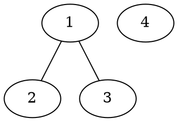

Dato un insieme V, definiamo con $\binom V2$ (che si legge "V su 2") l'insieme i cui elementi sono tutti e soli i sottoinsiemi di V con 2 elementi (cioè 2-sottoinsiemi di V). In simboli, $\binom V2:=\{A\in 2^V||A|=2\}$.

$|\binom V2=\binom {|V|}2=\frac{|V||!}{2!(|V|-2)!}$

### Grafo semplice
Un grafo (semplice, non orientato) G è una coppia $G=(V,E)$ dove V è un insieme non vuoto detto insieme dei vertici di G e E è un sottoinsieme (eventualmente vuoto) di $\binom V2$ detto insieme dei lati di G.
Si indicano con $V(G)$ e $E(G)$.

### Grafi notevoli
1. Per ogni $n\in\Bbb N$, definiamo il cammino $P_n$ di lunghezza n. 
   - $V(P_n):=\{0,1,\dots,n\}$
   - $E(P_n):=\varnothing se\,n=0$
   - $E(P_n):=\{\{i,i+1\}\in\binom {V(P_n)}2|i\in\{0,1,\dots,n-1\}\}$
2. Per ogni $n\ge 3$, il ciclo $C_n$ di lunghezza n detto anche n-ciclo
   - $V(C_n):=\{0,1,\dots,n\}$
   - $E(C_n):=\{\{i,i+1\}\in\binom {V(C_n)}2|i\in\{0,1,\dots,n-1\}\}\cup \{\{1,n\}\}$
3. Per ogni $n\ge 1$, il grafo completo su n vertici, denotato con $K_n$
   - $V(K_n):=\{0,1,\dots,n\}$
   - $E(K_n):=\binom{V(K_n)}{2}$

Def.
Siano $G=(V,E)$ e $G'=(V',E')$ due grafi. Diciamo che G' è un sottografo di G (in simboli $G'<G$) se
$$V'\subset V,E'\subset E$$
Se G' è un sottografo di G e vale 
$$E'=\{e\in E|e=\{v_1,v_2\},v_1\in V,v_2\in V'\}$$
allora G' si dice sottografo di G indotto da V' e si indica con $G'=G[V']$

