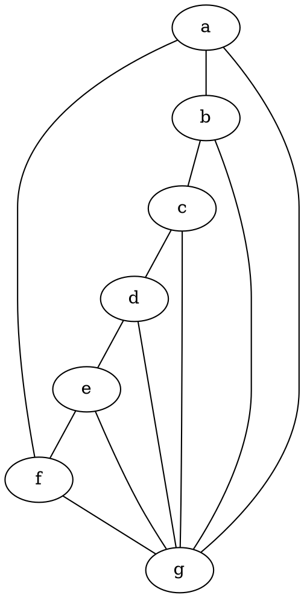
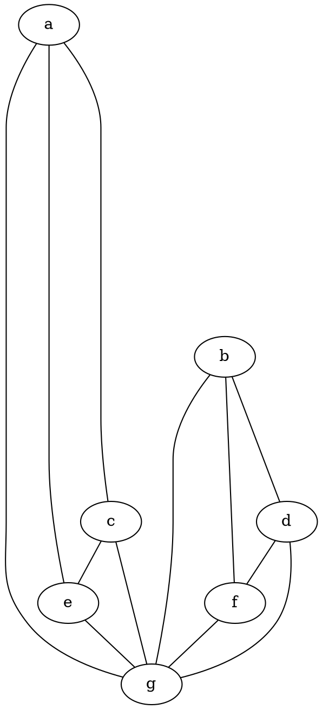

### Proprietà dei grafi isomorfi
Siano G e G' due grafi isomorfi (finiti), allora:
- $score(G)=score(G')$
- G e G' hanno lo stesso numero di componenti connesse.
- G è 2-connesso $\iff$ G' è 2-connesso
- G è hamiltoniano $\iff$ G' è hamiltoniano

### Ostruzioni alla connessione

Sia G un grafo, un sottografo T di G è un albero di copertura di G se valgono le seguenti condizioni:
- T è un albero
- V(T)=V(G)

Oss. Se G ammette un albero di copertura allora è connesso.
