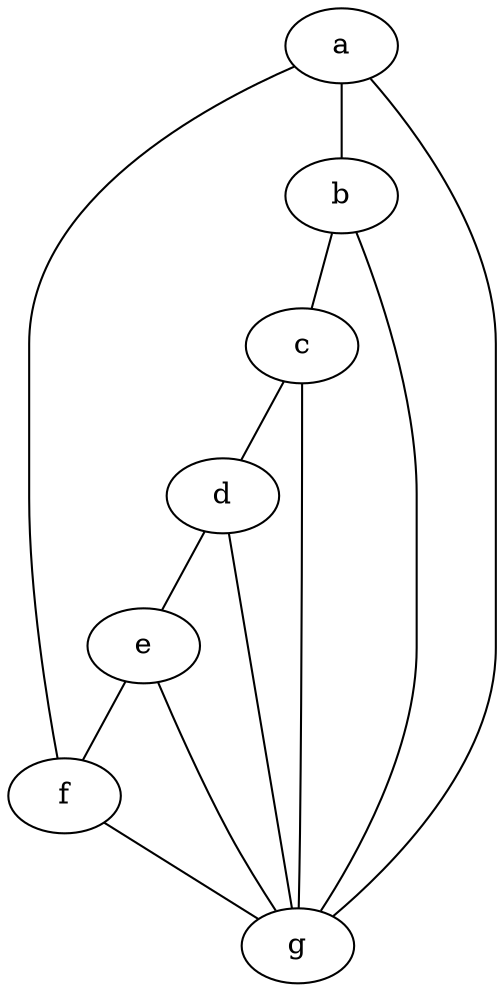
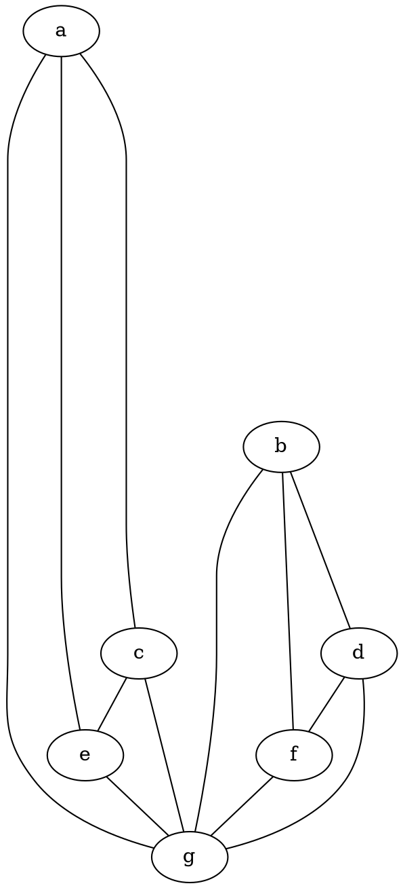

### Proprietà dei grafi isomorfi
Siano G e G' due grafi isomorfi (finiti), allora:
- $score(G)=score(G')$
- G e G' hanno lo stesso numero di componenti connesse.
- G è 2-connesso $\iff$ G' è 2-connesso
- G è hamiltoniano $\iff$ G' è hamiltoniano

### Ostruzioni allo score
1. L'ultimo grado deve essere $\le n-1$.
2. Il minimo grado deve essere almeno il numero di volte che compaiono vertici di grado n-1.
3. L = numero di entrate di grado $\ge$ 2 diverse dalle ultime due. Se $L \le d_n + d_{n-1} - n$ allora non è lo score di un grafo.
4. Lemma delle strette di mano

### Ostruzioni alla connessione

Sia G un grafo, un sottografo T di G è un albero di copertura di G se valgono le seguenti condizioni:
- T è un albero
- V(T)=V(G)

Oss. Se G ammette un albero di copertura allora è connesso.
Theo. Ogni grafo finito e connesso ammette almeno un  albero di copertura

##### Lemma di Forzatura alla sconnessione
Siano $n\in\Bbb N\setminus\{0\}$ e $d=(d_0,d_1,\dots,d_n)\in\Bbb N^n$, se vale 
$$\frac 12 \sum_{i=1}^nd_i < n-1$$
Allora tutti gli eventuali grafi con score d sono sconnessi.

##### Lemma di Forzatura alla connessione
Siano $n\in\Bbb N\setminus\{0\}$ e $d=(d_0,d_1,\dots,d_n)\in\Bbb N^n$, con $d_1\le\dots\le d_n$. Se vale
$$d_1 + d_n \ge n-1$$
allora tutti i grafi con score d sono connessi.