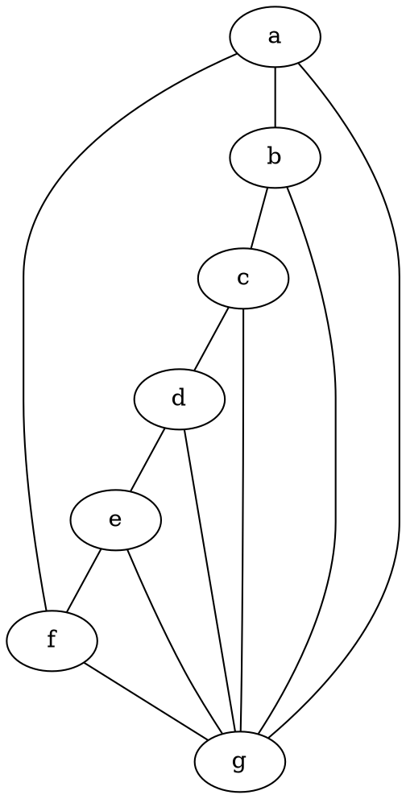
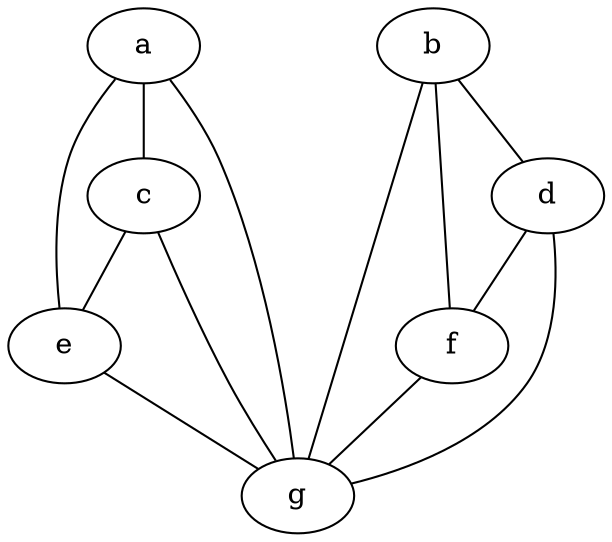

### Proprietà dei grafi isomorfi
Siano G e G' due grafi isomorfi (finiti), allora:
- $score(G)=score(G')$
- G e G' hanno lo stesso numero di componenti connesse.
- G è 2-connesso $\iff$ G' è 2-connesso
- G è hamiltoniano $\iff$ G' è hamiltoniano

